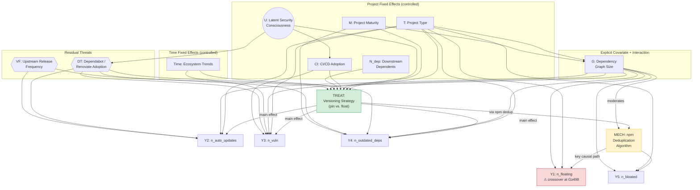

# Causal Credibility Analysis — Pinning Chapter

**Status:** Draft plan, pending author review
**Target file:** `analysis-pinning.tex`
**Placement:** Between RQ2 results (Section 4) and Discussion (Section 5)

---

## Tasks

- [ ] Draw DAG figure (`figs-pinning/dag-pinning.pdf`) for Step 1 (TikZ from the draft below)
- [ ] Write Step 1 — Causal Theory
- [ ] Write Step 2 — Causal Estimand and Identifying Assumptions
- [ ] Write Step 3 — Limitations and Known Caveats
- [ ] Write Step 4 — Alternative Explanations
- [ ] Add `\input{analysis-pinning}` to `main-pinning.tex` before Discussion
- [ ] Decide: supersede or cross-reference existing "Limitations and Threats to Validity" paragraphs in RQ1/RQ2 method sections (see Step 3 overlap analysis below)

---

## Step 1 — Explicit Causal Theory

**Goal:** Construct a DAG in which every node and every edge is justified by existing literature or domain knowledge, making the causal structure explicit and auditable.

### Node Inventory with Literature Justifications

All nodes are classified as *controlled* (by the study design), *explicit covariate* (included in the regression), or *residual threat* (time-varying and not fully absorbed).

---

#### Nodes Controlled by Project Fixed Effects (time-invariant confounders)

**T — Project type (package vs. application)**
- Effect on treatment: Packages (libraries) have strong incentive to use floating version ranges to avoid forcing duplicate installations on downstream consumers; applications have stronger incentive to pin for reproducibility. This distinction is explicit in Renovate's canonical documentation ("Should you Pin your JavaScript Dependencies?" renovatebot.com) and empirically confirmed by Wermke et al. ("The Design Space of Lockfiles Across Package Managers," arXiv:2505.04834, 2025), who find that four of six developers who declined lockfiles cited being library maintainers as the reason.
- Effect on outcomes: Project type is the single largest predictor of dependency graph topology. Kaestner et al. (FSE 2025, arXiv:2502.06662) document that npm packages have a median of 3 direct / 11 transitive production dependencies versus 11 direct / 150 transitive for GitHub repositories — an order-of-magnitude structural difference that directly determines all five outcome metrics. Latendresse et al. ("Not All Dependencies Are Equal," ASE 2022, arXiv:2207.14711) further show that less than 1% of installed dependencies reach production in application contexts, affecting the exploitability interpretation of `n_vuln`.

**M — Project maturity (age, release history, contributor count)**
- Effect on treatment: Javan et al. ("Dependency Update Strategies and Package Characteristics," TOSEM 2023, DOI:10.1145/3603110) find that the release of version 1.0.0 is a measurable inflection point after which highly-used packages shift from permissive (floating) to balanced strategies. Contributor count and the number of dependents both predict strategy choice in their regression analysis.
- Effect on outcomes: Zerouali, Constantinou, and Mens et al. ("An Empirical Analysis of Technical Lag in npm Package Dependencies," ICSR 2018) establish that technical lag — the gap between the in-use version and the latest available — accumulates over time, directly linking maturity to `n_outdated_deps`. Rahman et al. ("How Quickly Do Development Teams Update Their Vulnerable Dependencies?", arXiv:2403.17382, 2024) show that Mean Time To Update (MTTU) increases with project age independently of versioning strategy.

**U — Latent security-consciousness (unobserved)**
- Effect on treatment: Pashchenko, Vu, and Massacci ("A Qualitative Study of Dependency Management and Its Security Implications," CCS 2020, DOI:10.1145/3372297.3417232) find from 25 semi-structured interviews that security-conscious developers are more likely to adopt conservative dependency management practices. The "Prioritizing Security Practice Adoption" study (arXiv:2504.14026, 2025) operationalizes this, finding that repositories with more contributors are more likely to implement both pinning and code review practices in correlated fashion.
- Effect on outcomes: Security-conscious developers adopt automated tools (Dependabot/Renovate) and CI pipelines at higher rates, both of which directly reduce `n_vuln` and `n_outdated_deps` (EMSE 2025 Dependabot study, link.springer.com/article/10.1007/s10664-025-10638-w).
- This is an *unobserved* node; its effect is partially absorbed by project fixed effects to the extent that it is time-invariant.

**CI — CI/CD adoption**
- Effect on treatment: The "Prioritizing Security Practice Adoption" (arXiv:2504.14026, 2025) study finds that pinned dependencies (measured via OpenSSF Scorecard) correlate with CI adoption. Projects with CI pipelines have more to lose from a broken build caused by an automatic dependency update, giving them incentive to pin.
- Effect on outcomes: The Dependabot impact study (EMSE 2025) explicitly finds that "projects equipped with tests and CI tools are more likely to merge security updates," directly reducing `n_vuln` persistence. CI adoption is treated as a separate security metric from pinning in the OpenSSF Scorecard (Zahan et al., IEEE S&P 2023, arXiv:2208.03412).
- Mostly time-invariant within the 12-month study window; project FE absorbs the bulk of this.

**N\_dep — Number of downstream dependents**
- Effect on treatment: Javan et al. (TOSEM 2023) find that dependent count predicts dependency update strategy, with highly-used packages adopting more conservative versioning. Zimmermann et al. ("Small World with High Risks," USENIX Security 2019) find that popular packages face greater scrutiny and maintainer responsibility that affects their versioning conservatism.
- Effect on outcomes: Central packages' vulnerability exposure propagates further (Liu et al., "Demystifying Vulnerability Propagation," ICSE 2022, DOI:10.1145/3510003.3510142); the "Original Sin of npm" (arXiv:2604.17668, 2026) quantifies approximately 3.6 additional packages influenced per affected package.
- Relatively stable within the 12-month window; project FE approximately controls this.

---

#### Node Controlled by Time Fixed Effects

**Time — Calendar time / ecosystem trends**
- Effect on treatment: Kaestner et al. (FSE 2025) document the shift toward pinning beginning around 2020, linked to high-profile supply chain incidents (SolarWinds 2020, node-ipc 2022) and the OpenSSF Scorecard scoring pinning as a positive security practice.
- Effect on outcomes: The vulnerability database grew substantially over this period; Chinthanet, Kula et al. ("Lags in the Release, Adoption, and Propagation of npm Vulnerability Fixes," EMSE 2022, arXiv:1907.03407) document that vulnerability disclosure rates and propagation lag patterns changed significantly. Time fixed effects in the panel regression absorb this common shock.

---

#### Explicit Covariate with Interaction (moderator)

**G — Dependency graph size (number of nodes)**
- Effect on treatment: Larger projects have more complex dependency graphs and may choose different versioning strategies. Structurally, T and M both cause G (project type and maturity determine graph size), and G itself may inform the versioning strategy choice (practitioners aware of a large graph may reason about pinning differently).
- Effect on outcomes: Graph size is the dominant predictor of all five outcome metrics, since all metrics count occurrences within the dependency graph. The "How Deep Does Your Dependency Tree Go?" study (arXiv:2512.14739, 2025) documents 4.32× average dependency amplification in npm with extreme outliers reaching 785 total packages. The "Original Sin of npm" (arXiv:2604.17668, 2026) shows that packages with 4–6 dependency levels show peak vulnerability concentration and that projects with 298–812 dependencies show elevated CVE exposure.
- **Interaction with treatment:** The effect of pinning on `n_floating` is moderated by G — the key finding is a crossover at 498 nodes where pinning begins to *increase* attack surface. The interaction term `pinning × ln(size(G))` is included explicitly in the regression. G is both a confounder and a moderator, which is why it receives an explicit role in the model rather than being absorbed by fixed effects.

---

#### Residual Threats (time-varying, not fully controlled)

**DT — Automated dependency update tool adoption (Dependabot / Renovate)**
- Effect on treatment: Renovate's `rangeStrategy` configuration determines whether floating constraints in `package.json` are converted to pinned on each PR. Projects using Renovate in "pin" mode have a different effective versioning strategy than their `package.json` alone would suggest (Renovate docs). This creates measurement error in the treatment variable.
- Effect on outcomes: The Dependabot impact study (EMSE 2025) finds that Dependabot adoption reduces `n_vuln` (faster remediation, 57% merge rate), increases `n_auto_updates` (more PRs created), and reduces `n_outdated_deps`. DiVA (2024, "Evolving Trends in the Adoption and Effectiveness of Dependabot") confirms significantly faster vulnerability remediation. GitGuardian (2026) documents a security downside: 60% of malicious PRs were merged into projects with Dependabot auto-merge enabled, meaning DT can *increase* exposure to malicious updates.
- DT can change within the study window, making it only partially absorbed by project FE. It is a **residual threat** to internal validity for `n_vuln`, `n_auto_updates`, and `n_outdated_deps`.

**VF — Upstream dependency release frequency**
- Effect on treatment: When upstream dependencies release frequently, the maintenance burden of floating increases (frequent breaking changes, update noise), prompting some developers to switch to pinning (Javan et al., TOSEM 2023).
- Effect on outcomes: High-release-frequency dependencies generate more automatic updates (`n_auto_updates`) and stay fresher (`n_outdated_deps` is lower). Zerouali et al. (ICSR 2018) establish that technical lag is partly driven by upstream release cadence.
- Not controlled. A **residual threat** to `n_auto_updates` and `n_outdated_deps` estimates.

#### Deliberately Excluded from the DAG

**Lockfile adoption** (whether `package-lock.json` is committed and `npm ci` is used) is a real-world consideration but is not part of the causal structure relevant to the study. The outcome metrics are computed from simulated dependency graph resolutions, not from actual installations, so lockfile commit decisions do not affect any simulated outcome. Lockfile adoption is mentioned in the discussion section of the paper as a practical recommendation, but it is a nuance about how practitioners interpret the treatment in deployment, not a node in the causal DAG that governs the simulation. The DAG should not include it; the prose around the discussion may.

---

### DAG Diagram (Draft for Review)

The diagram below is a draft for the TikZ figure. Nodes in **[brackets]** are controlled by the study design. Nodes in *{braces}* are residual threats. The red dashed path is the mechanism responsible for the key counterintuitive finding.

**Key paths to highlight in the text:**

1. **Identification path (white):** `Treat → Mech → Y1` — the structural mechanism through which all-pinning affects attack surface; the interaction `G × Treat → Mech` explains the crossover.
2. **Controlled confounding (gray):** All arrows from T, M, U, CI, N, Time into Treat and into outcomes — absorbed by project/time fixed effects.
3. **Residual confounding (red):** `DT → Treat` and `DT → Y2/Y3/Y4` — the main residual threat; projects adopting Renovate in "pin" mode have treatment assignment that differs from their raw `package.json`.
4. **Simulation eliminates selection bias:** Because both $Y(0)$ and $Y(1)$ are simulated for every unit, all arrows from confounders into *treatment assignment* are severed in the data-generating process of the study design (even though they exist in the structural DAG). The remaining threats are about measurement validity and the fidelity of the simulated potential outcomes.

---

## Step 2 — Causal Estimand and Identifying Assumptions

**Goal:** Define the causal estimands precisely, name the assumptions under which the panel regression coefficients admit a causal interpretation, and use this framework to analyze how each known limitation affects the credibility of the causal claim.

### Estimands

For each outcome metric $M$, let $Y_{it}(d)$ denote the value of $M$ for project $i$ at time $t$ under versioning strategy $d$, where $d=1$ denotes all-pinning and $d=0$ denotes the observed (predominantly floating) strategy.

The study targets two causal estimands:

- **Average Treatment Effect (ATE):** $\tau_{\text{ATE}} = E[Y_{it}(1) - Y_{it}(0)]$
- **Conditional Average Treatment Effect by graph size (CATE):** $\tau(G) = E[Y_{it}(1) - Y_{it}(0) \mid \text{size}(G_{it}) = G]$

The panel regression estimates the ATE through the main coefficient on *pinning* and traces the CATE through the *pinning* $\times \ln(\text{size}(G))$ interaction.
Because the simulation produces both potential outcomes for every project-time unit from the same `package.json`, the design is structurally a within-project paired experiment, and the project and time fixed effects absorb time-invariant project heterogeneity and common time shocks.

### Identifying Assumptions

**A1. Simulation fidelity.**
The simulated counterfactual outcomes have the same expected value as the actual potential outcomes would have had under the corresponding versioning strategy.
This is the primary identifying assumption: unlike in a standard observational study, selection-into-treatment confounding is not the main threat — measurement validity of the simulated counterfactual is.
Violations arise if npm's resolver algorithm changed between the historical timestamp and the simulation date, or if local environment configurations (e.g., `.npmrc`, workspace settings) differ between historical and simulated environments.

**A2. No interference (SUTVA Part 1).**
A project's outcomes under its assigned versioning strategy do not depend on the strategies adopted by other projects.
This holds at the project level because npm resolves each project's dependency graph independently of other projects.
RQ2 deliberately violates this assumption by design — ecosystem-level interference is the entire point — which is why RQ2 uses a network propagation simulation rather than a panel regression.

**A3. Consistent treatment value (SUTVA Part 2).**
There exists a single well-defined version of the treatment "all-pinning."
In practice, pinning is a spectrum: projects may pin all direct dependencies, pin only a subset, or use a lockfile with floating constraints.
The simulation imposes the most extreme variant.
The estimated effect therefore corresponds to maximally aggressive pinning, not to the partial pinning that practitioners typically adopt.

**A4. No residual time-varying confounding.**
After conditioning on project fixed effects, time fixed effects, and $\ln(\text{size}(G_{it}))$, no time-varying confounder remains that affects both the effective treatment and the outcomes.
From the DAG analysis, the main candidate violator is Dependabot/Renovate adoption, which can change within the study window and affects both the effective treatment definition (via Renovate's `rangeStrategy`) and the outcomes for vulnerabilities, outdated dependencies, and automatic updates.

Among the four assumptions, A2 and A3 are satisfied by the construction of the simulation rather than by appeal to empirical argument, and therefore do not surface as threats in Step 3. A2 holds because dependency resolution is deterministic given the `package.json` and a snapshot of the registry: project $i$'s simulated treatment has no causal pathway to project $j$'s simulated outcome, since the registry state is fixed by the time-travel mechanism and resolution does not consult other projects' configurations. A3 holds because the treatment is imposed by a deterministic transformation of the `package.json` — removing every caret and tilde from direct production dependencies and resolving to the minimum specified version — yielding a single, operationally well-defined version of all-pinning. The fact that real-world pinning is a spectrum bears on which estimand is policy-relevant, not on whether the simulated estimand is causally identified; that concern belongs to external validity and is addressed in the existing Limitations paragraphs. The credibility of the causal claim therefore rests on A1 and A4, the two assumptions Step 3 examines.

RQ2 is identified through a separate network propagation simulation rather than through the potential-outcomes framework above; its assumptions and their direction of bias are addressed in the existing limitations subsection of the RQ2 method section.

---

## Step 3 — Limitations and Known Caveats

**Goal:** Acknowledge the residual threats to the *causal credibility* of the RQ1 estimates after the design's controls. Limitations that concern external validity, measurement validity, treatment generalizability, or the RQ2 ecosystem simulation are not threats to causal identification and are covered in the existing "Limitations and Threats to Validity" subsections of the paper; this section briefly notes them and refers the reader there.

### Causal Credibility Limitations

The simulation design eliminates the standard observational confounders identified in the DAG (selection-into-treatment by project type, maturity, security-consciousness, CI adoption, and downstream dependents), and the panel fixed effects absorb time-invariant project heterogeneity and common time shocks. Two threats to internal causal validity remain:

| Limitation | Assumption Threatened | Direction of Bias | Analysis |
|---|---|---|---|
| Simulation failures (12–16% of resolutions) | A1 (simulation fidelity) | Lower bound on `n_bloated` cost | Resolution failures are not random: pinning introduces more version conflicts, so success rates differ between treatment and control conditions. Projects with the most severe conflicts — where the bloat cost of pinning would be highest — are disproportionately excluded from the analysis sample. The reported pinning effect on `n_bloated` is therefore a lower bound on the true cost. |
| Dependabot/Renovate adoption (DT) | A4 (no residual time-varying confounding) | Direction unclear | DT can change within the 12-month study window and is not absorbed by project fixed effects. It confounds the relationship between the declared versioning strategy and `n_vuln`, `n_outdated_deps`, and `n_auto_updates`: projects using Renovate in pin mode have an effective treatment that differs from their `package.json` alone, and DT independently reduces vulnerability lag. Direction of bias depends on whether DT adoption correlates with $G$ within projects; if security-conscious projects both adopt DT and have larger graphs, the $G$ interaction term partially absorbs this. |

### Limitations Outside the Scope of Causal Credibility

The all-or-nothing treatment definition, the absence of a modeled developer behavioral response, the uniform random attack assumption underlying the interpretation of `n_floating`, the npm-specific scope of the deduplication mechanism, and the simplifying assumptions in the RQ2 ecosystem-level network simulation are concerns about external validity, measurement validity, treatment definition, or ecosystem-specific scope rather than threats to the internal identification of the RQ1 causal estimate. These are addressed in the existing "Limitations and Threats to Validity" paragraphs in Section~\ref{sec:method-rq1} (RQ1) and Section~\ref{sec:method-rq3} (RQ2) of the paper.

---

## Step 4 — Alternative Explanations

**Goal:** Identify the two or three most threatening alternative causal structures and explain why the design either rules them out or cannot fully exclude them.

### Alternative 1 — Simulation Artifact for the Crossover Finding

The counterintuitive result (pinning increases `n_floating` for large graphs) could be a simulation artifact if the `--before` resolver produces systematically different deduplication behavior for pinned vs. floating `package.json` files at high graph complexity.

**Why the design is defensible:** The mechanism (deduplication creating additional transitive version copies when version conflicts arise from pinning) is structurally documented in npm's resolver implementation (npm v3+ architecture, how-npm3-works) and is illustrated with a minimal worked example in Figure 7 of the paper. The crossover point at 498 nodes is consistent with the mechanism activating only once enough version conflicts accumulate in the transitive graph — a continuous, not discontinuous, process. The finding replicates across four robustness checks (npm packages only, GitHub repositories only, $t_0$ only, development dependencies included), each representing a distinct subpopulation. A simulation artifact would need to produce the same spurious crossover point in all four populations, which is implausible.

### Alternative 2 — Dependabot/Renovate as Confounder for `n_vuln` and `n_outdated_deps`

Projects that adopted Dependabot/Renovate within the study window have lower `n_vuln` and `n_outdated_deps` regardless of their pinning strategy. If DT adoption increased during the observation period AND is correlated with G (e.g., larger projects adopt automated tools earlier), the estimated cost of pinning on `n_vuln` and `n_outdated_deps` could be confounded.

**Why the design partially addresses this:** Project fixed effects absorb time-invariant DT adoption. The risk is new adoptions within the 12-month window. The literature suggests DT adoption is relatively slow and lumpy rather than continuously varying — most projects either have it or don't for the duration of a 12-month panel. The direction of confounding, if present, would *reduce* the estimated costs of pinning (DT compensates for pinning-induced vulnerability lag), making the reported costs conservative lower bounds.

### Alternative 3 — Ecosystem Position Confounding for RQ2

Packages selected by the betweenness-weighted-by-downloads heuristic for coordinated defense are not a random sample — they are structurally central, high-download packages that may have more institutional resources, more maintainers, and faster update cycles independent of any pinning intervention.

**How to address:** This is correct and should be acknowledged openly. The RQ2 counterfactual is "what if these specific packages adopted coordinated pinning and auditing" — so the intervention is package-selection-plus-pinning, not pinning alone. The results answer the question that practitioners and foundation funders actually face: if resources are allocated to defend the most impactful packages, what risk reduction is achievable? The inseparability of package selection from the pinning intervention is a feature of the research question, not a confound.

---

## Open Questions (Resolved / Remaining)

- [x] **DAG scope:** Focus on RQ1 for the main DAG figure; note RQ2's network simulation approach in prose. The two questions have structurally different identification strategies and a single DAG would be misleading.
- [x] **Formalism level for Step 2:** Full $E[Y(d)]$ notation with CATE and ATE; see formal setup above.
- [x] **Overlap with existing Limitations paragraphs:** The causal credibility analysis section *complements* (does not supersede) the existing Limitations subsections. The existing subsections should remain as technical discussions of simulation engineering choices. The causal credibility analysis section adds the formal causal interpretation of those choices. A cross-reference ("for a causal interpretation of these limitations, see Section X") in the existing subsections is the right approach.
