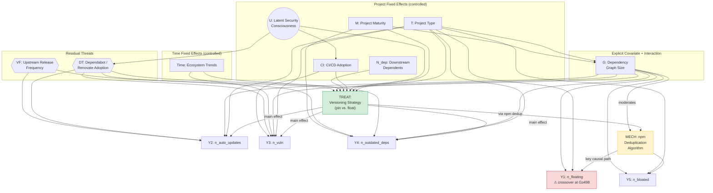

# Causal Credibility Analysis — Pinning Chapter

**Status:** Draft plan, pending author review
**Target file:** `analysis-pinning.tex`
**Placement:** Between RQ2 results (Section 4) and Discussion (Section 5)

---

## Tasks

- [ ] Draw DAG figure (`figs-pinning/dag-pinning.pdf`) for Step 1 (TikZ from the draft below)
- [ ] Write Step 1 — Causal Theory
- [ ] Write Step 2 — Causal Estimand and Identifying Assumptions
- [ ] Write Step 3 — Limitations and Known Caveats
- [ ] Write Step 4 — Alternative Explanations
- [ ] Add `\input{analysis-pinning}` to `main-pinning.tex` before Discussion
- [ ] Decide: supersede or cross-reference existing "Limitations and Threats to Validity" paragraphs in RQ1/RQ2 method sections (see Step 3 overlap analysis below)

---

## Step 1 — Explicit Causal Theory

**Goal:** Construct a DAG in which every node and every edge is justified by existing literature or domain knowledge, making the causal structure explicit and auditable.

### Node Inventory with Literature Justifications

All nodes are classified as *controlled* (by the study design), *explicit covariate* (included in the regression), or *residual threat* (time-varying and not fully absorbed).

---

#### Nodes Controlled by Project Fixed Effects (time-invariant confounders)

**T — Project type (package vs. application)**
- Effect on treatment: Packages (libraries) have strong incentive to use floating version ranges to avoid forcing duplicate installations on downstream consumers; applications have stronger incentive to pin for reproducibility. This distinction is explicit in Renovate's canonical documentation ("Should you Pin your JavaScript Dependencies?" renovatebot.com) and empirically confirmed by Wermke et al. ("The Design Space of Lockfiles Across Package Managers," arXiv:2505.04834, 2025), who find that four of six developers who declined lockfiles cited being library maintainers as the reason.
- Effect on outcomes: Project type is the single largest predictor of dependency graph topology. Kaestner et al. (FSE 2025, arXiv:2502.06662) document that npm packages have a median of 3 direct / 11 transitive production dependencies versus 11 direct / 150 transitive for GitHub repositories — an order-of-magnitude structural difference that directly determines all five outcome metrics. Latendresse et al. ("Not All Dependencies Are Equal," ASE 2022, arXiv:2207.14711) further show that less than 1% of installed dependencies reach production in application contexts, affecting the exploitability interpretation of `n_vuln`.

**M — Project maturity (age, release history, contributor count)**
- Effect on treatment: Javan et al. ("Dependency Update Strategies and Package Characteristics," TOSEM 2023, DOI:10.1145/3603110) find that the release of version 1.0.0 is a measurable inflection point after which highly-used packages shift from permissive (floating) to balanced strategies. Contributor count and the number of dependents both predict strategy choice in their regression analysis.
- Effect on outcomes: Zerouali, Constantinou, and Mens et al. ("An Empirical Analysis of Technical Lag in npm Package Dependencies," ICSR 2018) establish that technical lag — the gap between the in-use version and the latest available — accumulates over time, directly linking maturity to `n_outdated_deps`. Rahman et al. ("How Quickly Do Development Teams Update Their Vulnerable Dependencies?", arXiv:2403.17382, 2024) show that Mean Time To Update (MTTU) increases with project age independently of versioning strategy.

**U — Latent security-consciousness (unobserved)**
- Effect on treatment: Pashchenko, Vu, and Massacci ("A Qualitative Study of Dependency Management and Its Security Implications," CCS 2020, DOI:10.1145/3372297.3417232) find from 25 semi-structured interviews that security-conscious developers are more likely to adopt conservative dependency management practices. The "Prioritizing Security Practice Adoption" study (arXiv:2504.14026, 2025) operationalizes this, finding that repositories with more contributors are more likely to implement both pinning and code review practices in correlated fashion.
- Effect on outcomes: Security-conscious developers adopt automated tools (Dependabot/Renovate) and CI pipelines at higher rates, both of which directly reduce `n_vuln` and `n_outdated_deps` (EMSE 2025 Dependabot study, link.springer.com/article/10.1007/s10664-025-10638-w).
- This is an *unobserved* node; its effect is partially absorbed by project fixed effects to the extent that it is time-invariant.

**CI — CI/CD adoption**
- Effect on treatment: The "Prioritizing Security Practice Adoption" (arXiv:2504.14026, 2025) study finds that pinned dependencies (measured via OpenSSF Scorecard) correlate with CI adoption. Projects with CI pipelines have more to lose from a broken build caused by an automatic dependency update, giving them incentive to pin.
- Effect on outcomes: The Dependabot impact study (EMSE 2025) explicitly finds that "projects equipped with tests and CI tools are more likely to merge security updates," directly reducing `n_vuln` persistence. CI adoption is treated as a separate security metric from pinning in the OpenSSF Scorecard (Zahan et al., IEEE S&P 2023, arXiv:2208.03412).
- Mostly time-invariant within the 12-month study window; project FE absorbs the bulk of this.

**N\_dep — Number of downstream dependents**
- Effect on treatment: Javan et al. (TOSEM 2023) find that dependent count predicts dependency update strategy, with highly-used packages adopting more conservative versioning. Zimmermann et al. ("Small World with High Risks," USENIX Security 2019) find that popular packages face greater scrutiny and maintainer responsibility that affects their versioning conservatism.
- Effect on outcomes: Central packages' vulnerability exposure propagates further (Liu et al., "Demystifying Vulnerability Propagation," ICSE 2022, DOI:10.1145/3510003.3510142); the "Original Sin of npm" (arXiv:2604.17668, 2026) quantifies approximately 3.6 additional packages influenced per affected package.
- Relatively stable within the 12-month window; project FE approximately controls this.

---

#### Node Controlled by Time Fixed Effects

**Time — Calendar time / ecosystem trends**
- Effect on treatment: Kaestner et al. (FSE 2025) document the shift toward pinning beginning around 2020, linked to high-profile supply chain incidents (SolarWinds 2020, node-ipc 2022) and the OpenSSF Scorecard scoring pinning as a positive security practice.
- Effect on outcomes: The vulnerability database grew substantially over this period; Chinthanet, Kula et al. ("Lags in the Release, Adoption, and Propagation of npm Vulnerability Fixes," EMSE 2022, arXiv:1907.03407) document that vulnerability disclosure rates and propagation lag patterns changed significantly. Time fixed effects in the panel regression absorb this common shock.

---

#### Explicit Covariate with Interaction (moderator)

**G — Dependency graph size (number of nodes)**
- Effect on treatment: Larger projects have more complex dependency graphs and may choose different versioning strategies. Structurally, T and M both cause G (project type and maturity determine graph size), and G itself may inform the versioning strategy choice (practitioners aware of a large graph may reason about pinning differently).
- Effect on outcomes: Graph size is the dominant predictor of all five outcome metrics, since all metrics count occurrences within the dependency graph. The "How Deep Does Your Dependency Tree Go?" study (arXiv:2512.14739, 2025) documents 4.32× average dependency amplification in npm with extreme outliers reaching 785 total packages. The "Original Sin of npm" (arXiv:2604.17668, 2026) shows that packages with 4–6 dependency levels show peak vulnerability concentration and that projects with 298–812 dependencies show elevated CVE exposure.
- **Interaction with treatment:** The effect of pinning on `n_floating` is moderated by G — the key finding is a crossover at 498 nodes where pinning begins to *increase* attack surface. The interaction term `pinning × ln(size(G))` is included explicitly in the regression. G is both a confounder and a moderator, which is why it receives an explicit role in the model rather than being absorbed by fixed effects.

---

#### Residual Threats (time-varying, not fully controlled)

**DT — Automated dependency update tool adoption (Dependabot / Renovate)**
- Effect on treatment: Renovate's `rangeStrategy` configuration determines whether floating constraints in `package.json` are converted to pinned on each PR. Projects using Renovate in "pin" mode have a different effective versioning strategy than their `package.json` alone would suggest (Renovate docs). This creates measurement error in the treatment variable.
- Effect on outcomes: The Dependabot impact study (EMSE 2025) finds that Dependabot adoption reduces `n_vuln` (faster remediation, 57% merge rate), increases `n_auto_updates` (more PRs created), and reduces `n_outdated_deps`. DiVA (2024, "Evolving Trends in the Adoption and Effectiveness of Dependabot") confirms significantly faster vulnerability remediation. GitGuardian (2026) documents a security downside: 60% of malicious PRs were merged into projects with Dependabot auto-merge enabled, meaning DT can *increase* exposure to malicious updates.
- DT can change within the study window, making it only partially absorbed by project FE. It is a **residual threat** to internal validity for `n_vuln`, `n_auto_updates`, and `n_outdated_deps`.

**VF — Upstream dependency release frequency**
- Effect on treatment: When upstream dependencies release frequently, the maintenance burden of floating increases (frequent breaking changes, update noise), prompting some developers to switch to pinning (Javan et al., TOSEM 2023).
- Effect on outcomes: High-release-frequency dependencies generate more automatic updates (`n_auto_updates`) and stay fresher (`n_outdated_deps` is lower). Zerouali et al. (ICSR 2018) establish that technical lag is partly driven by upstream release cadence.
- Not controlled. A **residual threat** to `n_auto_updates` and `n_outdated_deps` estimates.

**L — Lockfile adoption (`package-lock.json` committed to repo)**
- *Note: Lockfile adoption affects real-world deployment but NOT the simulation.* The study's outcome metrics are computed from simulated dependency graph resolutions, not from actual installations. Whether a project commits its lockfile and uses `npm ci` is irrelevant to the simulation outcomes. However, lockfile adoption conflates with the *treatment definition* in the real world: a project floating in `package.json` but using `npm ci` is effectively pinned in practice. This is a measurement validity concern for the treatment variable's external interpretation, not an identification threat within the simulation.

---

### DAG Diagram (Draft for Review)

The diagram below is a draft for the TikZ figure. Nodes in **[brackets]** are controlled by the study design. Nodes in *{braces}* are residual threats. The red dashed path is the mechanism responsible for the key counterintuitive finding.

**Key paths to highlight in the text:**

1. **Identification path (white):** `Treat → Mech → Y1` — the structural mechanism through which all-pinning affects attack surface; the interaction `G × Treat → Mech` explains the crossover.
2. **Controlled confounding (gray):** All arrows from T, M, U, CI, N, Time into Treat and into outcomes — absorbed by project/time fixed effects.
3. **Residual confounding (red):** `DT → Treat` and `DT → Y2/Y3/Y4` — the main residual threat; projects adopting Renovate in "pin" mode have treatment assignment that differs from their raw `package.json`.
4. **Simulation eliminates selection bias:** Because both $Y(0)$ and $Y(1)$ are simulated for every unit, all arrows from confounders into *treatment assignment* are severed in the data-generating process of the study design (even though they exist in the structural DAG). The remaining threats are about measurement validity and the fidelity of the simulated potential outcomes.

---

## Step 2 — Causal Estimand and Identifying Assumptions

**Goal:** State the estimand formally in potential-outcomes notation with expectation operators, name each identifying assumption explicitly, and use the formal framework to analyze the impact of each known limitation on the causal interpretation.

### Formal Setup (RQ1)

Let $(i, t)$ denote project $i$ at time $t \in \{t_0, t_1, t_2, t_3, t_4\}$.
For each metric $M$, define the potential outcomes as:

$$Y_{it}(d) = \text{value of metric } M \text{ for project } i \text{ at time } t \text{ if its direct dependencies are versioned under strategy } d$$

where $d = 1$ denotes all-pinning and $d = 0$ denotes the observed (predominantly floating) strategy.

The study estimates the **Conditional Average Treatment Effect (CATE)** as a function of dependency graph size $G$:

$$\tau(G) = E\bigl[Y_{it}(1) - Y_{it}(0) \;\big|\; \ln(\text{size}(G_{it})) = G\bigr]$$

and the **Average Treatment Effect (ATE)**:

$$\tau_{\text{ATE}} = E\bigl[Y_{it}(1) - Y_{it}(0)\bigr]$$

The panel regression (Equation 1 in the paper) estimates $\tau_{\text{ATE}}$ and $\tau(G)$ simultaneously via the main coefficient on *pinning* and the interaction coefficient on *pinning* $\times \ln(\text{size}(G))$.

Because the simulation produces $\hat{Y}_{it}(0)$ (original resolution) and $\hat{Y}_{it}(1)$ (all-pinning resolution) for every unit, the design is structurally a **within-project paired experiment**. The regression estimator is thus:

$$\hat{\tau}(G) = \hat{E}\bigl[\hat{Y}_{it}(1) - \hat{Y}_{it}(0) \;\big|\; G_{it}\bigr]$$

where $\hat{Y}_{it}(d)$ denotes the simulated potential outcome. The project and time fixed effects $\alpha_i$ and $\beta_t$ ensure that the estimate is robust to time-invariant project heterogeneity and common time shocks, conditions that would otherwise bias a naive comparison between pinning and floating projects in observational data.

### Identifying Assumptions

**A1. Simulation Fidelity:**
$$E\bigl[\hat{Y}_{it}(d)\bigr] = E\bigl[Y_{it}(d)\bigr] \quad \text{for } d \in \{0, 1\}$$
The npm `--before` time-travel argument faithfully reconstructs the dependency graph that would have been produced by resolving the project's `package.json` at time $t$. Violations arise if npm's resolver algorithm changed between time $t$ and the simulation date, or if configuration files (`.npmrc`, workspace settings) differ between historical and simulated environments. This is the primary identifying assumption: unlike in a standard observational study, selection-into-treatment confounding is not the main threat. Instead, measurement validity of the simulated potential outcomes is.

**A2. No Interference (SUTVA Part 1):**
$$Y_{it}(d_i) \perp D_{jt} \quad \text{for all } j \neq i$$
Project $i$'s outcomes under pinning strategy $d$ are not affected by what other projects do. This holds at the project level because npm resolves each project's dependency graph independently. It is deliberately violated in RQ2, which is why RQ2 uses a network propagation simulation rather than a panel regression.

**A3. Consistent Treatment Value (SUTVA Part 2):**
There exists a single well-defined version of the treatment $D = 1$ ("all-pinning"). In practice, "pinning" is a spectrum: projects may pin all direct dependencies, pin only a subset, or use a lockfile with floating constraints. The simulation imposes the most extreme version of the treatment (pin all direct dependencies to the minimum specified version). This means the estimated effect $\hat{\tau}(G)$ corresponds to the effect of the most aggressive pinning intervention, not to the partial pinning that practitioners typically adopt.

**A4. No Residual Time-Varying Confounding:**
After conditioning on project fixed effects $\alpha_i$, time fixed effects $\beta_t$, and $\ln(\text{size}(G_{it}))$, no remaining time-varying confounder $W_{it}$ satisfies $W_{it} \not\perp (Y_{it}(0), Y_{it}(1))$ and $W_{it} \not\perp D_{it}$ conditional on $(\alpha_i, \beta_t, G_{it})$. From the DAG analysis, the main candidate for violating this assumption is **Dependabot/Renovate adoption** (DT), which can change within the study window and affects both the effective treatment (DT determines actual update behavior) and the outcomes $Y_2$, $Y_3$, $Y_4$.

### How Limitations Formally Affect the Estimand

The formal framework allows us to specify precisely which assumption each limitation threatens, whether the threat is to internal or external validity, and the likely direction of bias:

| Limitation | Assumption Threatened | Type | Direction of Bias | Analysis |
|---|---|---|---|---|
| Simulation failures (12–16%) | A1 (simulation fidelity) | Internal | Underestimation of `n_bloated` | Let $R_{it}^{(d)} = 1$ if resolution under treatment $d$ succeeds. The study estimates $E[\hat{Y}_{it}(1) - \hat{Y}_{it}(0) \mid R_{it}^{(1)}=1, R_{it}^{(0)}=1]$. Pinning introduces more version conflicts → $P(R^{(1)}=1) < P(R^{(0)}=1)$. Projects with the most severe conflicts — the ones where $Y_5(1)$ (bloat) would be highest — are disproportionately excluded. The reported $\hat{\tau}$ for `n_bloated` is therefore a lower bound on the true cost of pinning. |
| All-or-nothing treatment | A3 (consistent treatment) | External | Effect size upper bound | The estimated $\hat{\tau}$ corresponds to $E[Y(d=\text{all-pin}) - Y(d=\text{observed})]$, not to the effect of typical partial pinning. Since the treatment is maximally aggressive, the estimated costs of pinning (higher `n_vuln`, `n_outdated_deps`, `n_bloated`) are upper bounds on the costs practitioners actually face. Conversely, the estimated benefits (lower `n_floating`) may understate what a more targeted pinning strategy could achieve. |
| No behavioral response modeled | A3 (consistent treatment) | External | Overestimation of pinning costs for `n_vuln` and `n_outdated_deps` | The simulated potential outcome $\hat{Y}_{it}(1)$ models all-pinning with zero developer response (no manual updates). The policy-relevant estimand is $E[Y_{it}(1, B^*) - Y_{it}(0)]$ where $B^*$ is the behavioral response developers would actually adopt when pinning. Since $B^* > 0$ (developers who pin actively manage updates), and active management reduces `n_vuln` and `n_outdated_deps`, the study overestimates the costs for these two metrics. Critically, this limitation does **not** affect the `n_floating` estimate, since attack surface is determined by version constraints in `package.json`, not by developer update behavior. |
| Uniform random attack assumption | Not an identifying assumption | Measurement validity | Conservative if attacks are targeted | The uniform assumption affects the *interpretation* of $Y_1$ = `n_floating` as a proxy for actual attack risk, not the identification of $E[Y_1(1) - Y_1(0)]$. The estimate of how pinning changes the number of floating dependencies remains causally valid; the question is whether reducing floating dependencies reduces actual attack probability in proportion. If attackers target floating-heavy packages (plausible, since they have larger reachable sets), the risk reduction from pinning is overestimated by `n_floating` as a proxy. |
| Dependabot/Renovate adoption (DT) | A4 (no residual time-varying confounding) | Internal | Direction unclear | DT confounds the treatment-outcome relationship for `n_vuln`, `n_outdated_deps`, and `n_auto_updates`. Projects adopting Renovate in pin mode have a different effective treatment from their `package.json`, and DT independently reduces `n_vuln` and `n_outdated_deps`. The direction of bias depends on whether DT adoption is positively or negatively correlated with G: if security-conscious projects are both more likely to adopt DT and have larger dependency graphs, the G interaction term partially absorbs this. |
| npm-specific deduplication | External validity | External | Not a bias — a scope limitation | The crossover finding at G ≥ 498 nodes depends entirely on npm's deduplication heuristic of installing multiple versions to resolve conflicts. In ecosystems using a single-version constraint solver (pip, Maven, Cargo), pinning increases `n_bloated` costs but does not produce negative `n_floating` effects. The study's causal claims are valid within npm; generalization requires separate analysis. |

### For RQ2

The RQ2 estimand is reduction in expected ecosystem-wide malicious update risk under coordinated defense. No potential-outcomes formalism is needed because the simulation explicitly constructs the outcome under each defense configuration. The identifying assumptions are instead the network propagation model assumptions:

- **Uniform attack selection** (attackers target randomly among top-$m$ packages): optimistic assumption for the defense, so estimates are upper bounds on effectiveness.
- **Perfect detection** (defended packages detect 100% of malicious updates instantly): optimistic, so estimates are upper bounds.
- **Immediate update** (defended packages update non-malicious releases instantly with zero latency): optimistic for the same reason.
- **Network approximation** (the package-level dependency network from latest versions approximates actual resolution behavior): introduces measurement noise of unknown direction; consistent with prior work using the same approximation (Zimmermann et al. 2019, Decan et al. 2019).

These assumptions are collectively *optimistic for the defense*, so the 30% (local pinning) and 75% (transitive pinning) risk reductions are upper bounds. Even as upper bounds, the results establish that coordinated ecosystem-level intervention is substantially more effective than individual project pinning.

---

## Step 3 — Limitations and Known Caveats

**Goal:** Honest, quantified acknowledgment of limitations that ties each to its formal impact on the estimand (from Step 2). Distinguish what is already stated in the existing "Limitations and Threats to Validity" paragraphs in the paper from what the causal credibility framework adds uniquely.

### Overlap Analysis with Existing Limitations Paragraphs

The existing "Limitations and Threats to Validity" subsections in the method sections (Sections 3.2 and 4.4) cover the following points:

| Existing Limitation (paper text) | What the Existing Text Says | What Causal Analysis Adds | Unique to Causal Credibility? |
|---|---|---|---|
| Simulation accuracy (§3.2) | Success ratio 83.6%/87.7%; failure causes (bad version constraints 42%, missing packages 37%); argues scale is comparable to medical/econometrics literature | Formalizes this as a differential sample selection problem: $E[\hat{Y}(1) \mid \text{success}]$ is estimated on a subpopulation that excludes the highest-bloat cases; characterizes this as a lower bound on `n_bloated` cost of pinning | **Partially unique**: the paper notes failures exist and argues they are acceptable; the causal analysis adds the *direction* and *formal mechanism* of the resulting bias |
| Developer actions not modeled (§3.2) | Frames as scope limitation: "all outcome metrics are estimated from the conservative case of no manual developer actions" | Re-frames as a SUTVA violation: the estimated $\hat{Y}(1)$ is "all-pinning with zero behavioral response," which is a different treatment from "all-pinning with typical developer behavior"; distinguishes which metrics are affected (Y3, Y4) vs. not affected (Y1) | **Unique to causal analysis**: the paper presents this as a scope/design choice; the causal framework reveals it creates a gap between the study estimand and the policy-relevant causal quantity |
| Uniform random assumption (§3.2) | Argues reasonableness of the assumption; notes static analysis or regression testing would severely limit data | Re-classifies as a *measurement validity* concern, not an identification assumption: the identification of $E[Y_1(1) - Y_1(0)]$ is valid regardless of attacker strategy; the question is whether `n_floating` is a valid proxy for attack risk | **Unique to causal analysis**: the paper defends the assumption on practical grounds; the causal framework clarifies *which claim* the assumption supports (construct validity of Y1 as risk proxy, not identification of the effect on Y1) |
| External validity: npm-specific (§3.2) | Notes that Maven, pip, Cargo have different baseline practices | Confirms this is a scope limitation with no internal validity implications; notes specifically that the crossover finding requires npm's multi-version deduplication and would not replicate in single-version ecosystems | **Not unique**: this is a standard external validity limitation clearly stated in the paper |
| Simplifying assumptions for RQ2 (§4.4) | Lists: random attack selection, perfect detection, immediate updates; notes results are robust under different attack selection strategies | Re-frames these as *optimistic assumptions* that make the estimates upper bounds on effectiveness; argues this is a conservative framing for practitioner guidance | **Partially unique**: the paper lists these; the causal analysis provides a unified characterization (all are optimistic for defense → results are upper bounds) |

### What the Causal Credibility Analysis Adds Beyond the Existing Text

The existing limitations paragraphs serve a different purpose from the causal credibility analysis. They address technical and methodological concerns about the simulation's accuracy. The causal analysis adds:

1. **Assumption labeling**: Each limitation is tied to a named identifying assumption (A1–A4), making the logical chain from limitation to potential bias explicit.
2. **Direction of bias characterization**: Rather than noting that a limitation exists, the analysis characterizes whether the resulting bias is upward or downward for each metric, and for which metrics the limitation is irrelevant.
3. **Internal vs. external validity distinction**: The existing text treats all limitations uniformly. The causal framework distinguishes between threats to internal validity (simulation fidelity, residual confounding by DT) that affect the credibility of the causal estimate itself, versus threats to external validity (all-or-nothing treatment, npm-specificity) that limit generalization without undermining the within-npm causal claim.
4. **The behavioral response gap**: The paper presents "no developer actions" as a conservative design choice. The causal framework reveals it as a gap between the study estimand (the effect of structural constraint change alone) and the policy-relevant estimand (the effect of a versioning strategy switch including the behavioral changes it induces). This distinction matters for interpreting practical implications.
5. **Measurement validity vs. identification**: The uniform random attack assumption is re-classified as a measurement validity concern rather than an identification assumption, which clarifies the logical status of the `n_floating` findings.

---

## Step 4 — Alternative Explanations

**Goal:** Identify the two or three most threatening alternative causal structures and explain why the design either rules them out or cannot fully exclude them.

### Alternative 1 — Simulation Artifact for the Crossover Finding

The counterintuitive result (pinning increases `n_floating` for large graphs) could be a simulation artifact if the `--before` resolver produces systematically different deduplication behavior for pinned vs. floating `package.json` files at high graph complexity.

**Why the design is defensible:** The mechanism (deduplication creating additional transitive version copies when version conflicts arise from pinning) is structurally documented in npm's resolver implementation (npm v3+ architecture, how-npm3-works) and is illustrated with a minimal worked example in Figure 7 of the paper. The crossover point at 498 nodes is consistent with the mechanism activating only once enough version conflicts accumulate in the transitive graph — a continuous, not discontinuous, process. The finding replicates across four robustness checks (npm packages only, GitHub repositories only, $t_0$ only, development dependencies included), each representing a distinct subpopulation. A simulation artifact would need to produce the same spurious crossover point in all four populations, which is implausible.

### Alternative 2 — Dependabot/Renovate as Confounder for `n_vuln` and `n_outdated_deps`

Projects that adopted Dependabot/Renovate within the study window have lower `n_vuln` and `n_outdated_deps` regardless of their pinning strategy. If DT adoption increased during the observation period AND is correlated with G (e.g., larger projects adopt automated tools earlier), the estimated cost of pinning on `n_vuln` and `n_outdated_deps` could be confounded.

**Why the design partially addresses this:** Project fixed effects absorb time-invariant DT adoption. The risk is new adoptions within the 12-month window. The literature suggests DT adoption is relatively slow and lumpy rather than continuously varying — most projects either have it or don't for the duration of a 12-month panel. The direction of confounding, if present, would *reduce* the estimated costs of pinning (DT compensates for pinning-induced vulnerability lag), making the reported costs conservative lower bounds.

### Alternative 3 — Ecosystem Position Confounding for RQ2

Packages selected by the betweenness-weighted-by-downloads heuristic for coordinated defense are not a random sample — they are structurally central, high-download packages that may have more institutional resources, more maintainers, and faster update cycles independent of any pinning intervention.

**How to address:** This is correct and should be acknowledged openly. The RQ2 counterfactual is "what if these specific packages adopted coordinated pinning and auditing" — so the intervention is package-selection-plus-pinning, not pinning alone. The results answer the question that practitioners and foundation funders actually face: if resources are allocated to defend the most impactful packages, what risk reduction is achievable? The inseparability of package selection from the pinning intervention is a feature of the research question, not a confound.

---

## Open Questions (Resolved / Remaining)

- [x] **DAG scope:** Focus on RQ1 for the main DAG figure; note RQ2's network simulation approach in prose. The two questions have structurally different identification strategies and a single DAG would be misleading.
- [x] **Formalism level for Step 2:** Full $E[Y(d)]$ notation with CATE and ATE; see formal setup above.
- [x] **Overlap with existing Limitations paragraphs:** The causal credibility analysis section *complements* (does not supersede) the existing Limitations subsections. The existing subsections should remain as technical discussions of simulation engineering choices. The causal credibility analysis section adds the formal causal interpretation of those choices. A cross-reference ("for a causal interpretation of these limitations, see Section X") in the existing subsections is the right approach.
